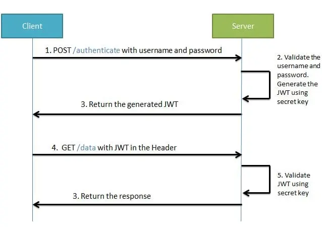

We will see how to configure InMemory user and jwt authentication using latest spring boot 3.0.
We will create one protected endpoint and try to secure endpoint using spring boot security.

# **Create new Spring Boot 3 Project**

Go to spring initializer and create new project with dependencies
add the following dependencies
For Web.

<dependency>
    <groupId>org.springframework.boot</groupId>
    <artifactId>spring-boot-starter-web</artifactId>
</dependency>

### **For security**

    <dependency>
    <groupId>org.springframework.boot</groupId>
    <artifactId>spring-boot-starter-security</artifactId>
    </dependency>

## **Lombok**

    <dependency>
        <groupId>org.projectlombok</groupId>
        <artifactId>lombok</artifactId>
        <optional>true</optional>
    </dependency>

## **For JWT**
     <!-- https://mvnrepository.com/artifact/io.jsonwebtoken/jjwt-api -->
    <dependency>
        <groupId>io.jsonwebtoken</groupId>
        <artifactId>jjwt-api</artifactId>
        <version>0.11.5</version>
    </dependency>

     <!-- https://mvnrepository.com/artifact/io.jsonwebtoken/jjwt-impl -->
    <dependency>
        <groupId>io.jsonwebtoken</groupId>
        <artifactId>jjwt-impl</artifactId>
        <version>0.11.5</version>
        <scope>runtime</scope>
    </dependency>

    <dependency>
        <groupId>io.jsonwebtoken</groupId>
        <artifactId>jjwt-jackson</artifactId> <!-- or jjwt-gson if Gson is preferred -->
        <version>0.11.5</version>
        <scope>runtime</scope>
    </dependency>

Create InMemory user with UserDetailService Bean
Create UserDetailService bean and write the InMemory user implementation
Create CustomConfig class and create bean and also create two important bean PasswordEncoder and AuthenticationManager
so that we can use later.

Now we can login with given username and password by default spring security provide form login .

open browser and open

http://localhost:8080/test
when login form is prompted just login with username and password as given .

JWT Authentication Flow

## **_Steps to implement jwt token:_**

1)  Make sure spring-boot-starter-security is there in pom.xml

2)  Create Class JWTAthenticationEntryPoint that implement AuthenticationEntryPoint. Method of this class is called 
 whenever as exception is thrown due to unauthenticated user trying to access the resource that required authentication.
3) Create JWTHelper  class This class contains method related to perform operations with jwt token like generateToken,
  validateToken etc.
4) Create JWTAuthenticationFilter that extends OncePerRequestFilter and override method and write the 
   logic to check the token that is comming in header. We have to write 5 important logic
  Get Token from request
  Validate Token
  GetUsername from token
  Load user associated with this token
  set authentication
5) Configure spring security in configuration file
6) Create JWTRequest and JWTResponse to receive request data and send Login success response.
7)  Create login api to accept username and password and return token if username and password is correct.
   8) Test Application. 

       curl --location 'localhost:8080/auth/login' \
       --header 'Content-Type: application/json' \
       --data '{
       "email": "hasnat",
       "password": "hasnat"
       }'

